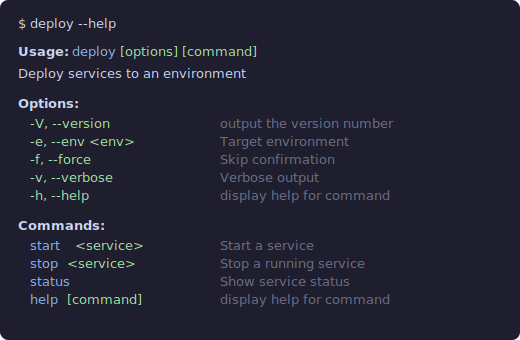

# @silvery/commander

Type-safe [Commander.js](https://github.com/tj/commander.js) with validated options, colorized help, and [Standard Schema](https://github.com/standard-schema/standard-schema) support. Drop-in replacement — `Command` extends Commander's `Command`. Install once, Commander is included.

```bash
npm install @silvery/commander
```

## Example

```typescript
import { Command, z } from "@silvery/commander"

const program = new Command("deploy")
  .description("Deploy services to an environment")
  .version("1.0.0")
  .option("-e, --env <env>", "Target environment", z.enum(["dev", "staging", "prod"]))
  .option("-f, --force", "Skip confirmation")
  .option("-v, --verbose", "Verbose output")

program
  .command("start <service>")
  .description("Start a service")
  .option("-p, --port <n>", "Port number", z.port)
  .option("-r, --retries <n>", "Retry count", z.int)
  .action((service, opts) => {
    /* ... */
  })

program
  .command("stop <service>")
  .description("Stop a running service")
  .action((service) => {
    /* ... */
  })

program
  .command("status")
  .description("Show service status")
  .option("--json", "Output as JSON")
  .action((opts) => {
    /* ... */
  })

program.parse()
const { env, force, verbose } = program.opts()
//      │     │       └─ boolean | undefined
//      │     └────────── boolean | undefined
//      └──────────────── "dev" | "staging" | "prod"
```

With plain Commander, `opts()` returns `Record<string, any>` — every value is untyped. With `@silvery/commander`, each `.option()` call narrows the return type of `.opts()` — no manual interfaces needed. Types are inferred from flag syntax (`--verbose` → `boolean`, `--port <n>` → `string`), parser functions (`port` → `number`, `csv` → `string[]`), schemas (`z.enum(...)` → union), and choices arrays. Accessing a nonexistent option is a compile error. Invalid values are rejected at parse time with clear error messages.

[Zod](https://github.com/colinhacks/zod) is entirely optional — `z` is tree-shaken from your bundle if you don't import it. Without Zod, use the built-in types (`port`, `int`, `csv`) or plain Commander.

Help is auto-colorized — bold headings, green flags, cyan commands, dim descriptions:

<p align="center">
  
</p>

Options with [Zod](https://github.com/colinhacks/zod) schemas or built-in types are validated at parse time with clear error messages.

## What's included

- **Colorized help** — automatic, with color level detection and [`NO_COLOR`](https://no-color.org)/`FORCE_COLOR` support via [`@silvery/ansi`](https://github.com/beorn/silvery/tree/main/packages/ansi) (optional)
- **Typed `.option()` parsing** — pass a type as the third argument:
  - 14 built-in types — `port`, `int`, `csv`, `url`, `email`, `date`, [more](https://silvery.dev/reference/commander)
  - Array choices — `["dev", "staging", "prod"]`
  - [Zod](https://github.com/colinhacks/zod) schemas — `z.port`, `z.int`, `z.csv`, or any custom `z.string()`, `z.number()`, etc.
  - Any [Standard Schema](https://github.com/standard-schema/standard-schema) library — [Valibot](https://github.com/fabian-hiller/valibot), [ArkType](https://github.com/arktypeio/arktype)
  - All types usable standalone via `.parse()`/`.safeParse()`

## Docs

Full reference, type table, and API details at **[silvery.dev/reference/commander](https://silvery.dev/reference/commander)**.

## Typed `.action()` and `.actionMerged()`

`.action()` is Commander-native: positional arguments, then the options object, then the command instance. Every positional is fully typed from the `.argument()` chain, and `opts` is fully typed from the `.option()` chain:

```ts
new Command("deploy")
  .argument("<service>", "Service to deploy")
  .argument("[env]", "Environment", ["dev", "staging", "prod"] as const)
  .option("--verbose", "Verbose output")
  .action((service, env, opts) => {
    service // string
    env // "dev" | "staging" | "prod" | undefined
    opts.verbose // boolean | undefined
  })
```

For commands with several positional arguments, `.actionMerged()` provides a flat named-object form:

```ts
new Command("deploy")
  .argument("<service>", "Service to deploy")
  .argument("[env]", "Environment", ["dev", "staging", "prod"] as const)
  .option("-p, --port <n>", "Port", port)
  .option("--verbose", "Verbose output")
  .actionMerged(({ service, env, port, verbose }, cmd) => {
    // Everything in one destructured object.
    // `cmd` is the Command instance.
  })
```

`.actionMerged()` merges all arguments (by camelCased name) and options into a single `params` object. It's a convenience over `.action()` — use whichever reads better for your command.

**Picking between them:**

- `.action()` — better for commands with zero or one positional argument, or when you want access to the command instance as a trailing argument. Matches Commander.js muscle memory.
- `.actionMerged()` — better for commands with 2+ positional arguments, where a flat object is nicer than nested destructure.

Both forms are fully typed end-to-end. The only runtime difference is whether arguments are merged into the params object or passed positionally.

If you define args in the `.command()` string instead (e.g. `.command("deploy <service>")`),
Commander's default behavior applies (separate positional parameters, untyped).
For full type safety, prefer `.argument()` on the subcommand.

## Replaces `@commander-js/extra-typings`

[`@commander-js/extra-typings`](https://github.com/commander-js/extra-typings) pioneered chain-inferred option types for Commander.js — each `.option()` call narrows the type of `.opts()`. We use the same idea but with a much simpler implementation (~100 lines vs. 1536 lines) because we own the `Command` class rather than wrapping someone else's.

`extra-typings` re-declares Commander's entire API from the outside — every method, every overload, every generic parameter — because it's a type-only wrapper around a class it doesn't control. We use interface merging on our own class and only type the methods that matter (`.option()`, `.opts()`, `.action()`). Modern TS features (const type parameters, template literal types) keep the flag-parsing utilities clean.

If you're using `@silvery/commander`, you don't need `@commander-js/extra-typings`.

## Credits

- **[Commander.js](https://github.com/tj/commander.js)** by TJ Holowaychuk and contributors
- **[@commander-js/extra-typings](https://github.com/commander-js/extra-typings)** — inspired the type inference approach
- **[Standard Schema](https://github.com/standard-schema/standard-schema)** — universal schema interop protocol
- **[@silvery/ansi](https://github.com/beorn/silvery/tree/main/packages/ansi)** — terminal capability detection

## License

MIT
